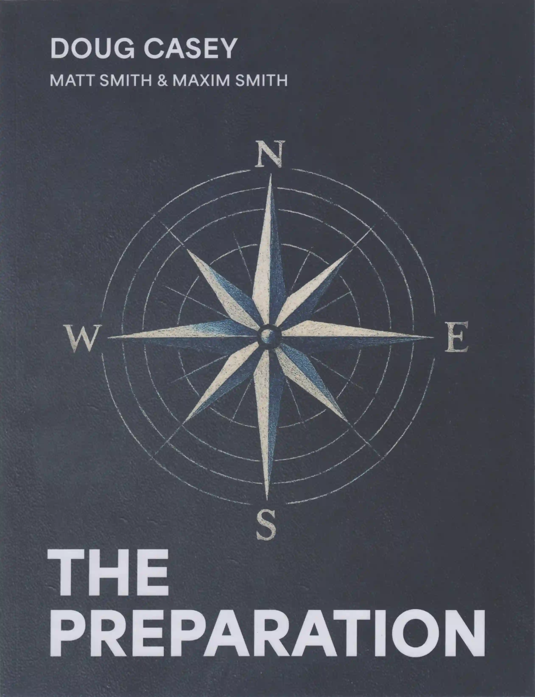

# Doug Casey - The Preparation (2025)



https://www.amazon.de/dp/B0FLRKYCCP

<blockquote>

**The Preparation: How To Become Competent, Confident, and Dangerous**

Doug Casey (Author), Matt Smith (Author), Maxim Smith (Author)

4.7 out of 5 stars, 39 ratings

**Skip the debt. Build the man.**

What if you could trade four stagnant years in lecture halls for four years of adventure — emerging as a debt‑free
EMT, pilot, welder, web/app builder, rancher, and entrepreneur all in one?

**The Preparation** is the field manual for young men (and the parents who love them)
who know the old college formula is broken and want a roadmap
that actually forges competence, confidence, and real‑world value.

Written by three generations — legendary investor and bestselling author Doug Casey,
entrepreneur Matt Smith, and twenty‑year‑old “beta tester” Maxim Smith —
this book distills their hard‑won wisdom into a four‑year, 16‑cycle program you can start tomorrow.

- **16 themed cycles** — Medic, Cowboy, Pilot, Fighter, Hacker, Maker, and more —
  each built around a hands‑on “Anchor Course” that forces you to learn by doing, not by cramming.
- **Earn‑while‑you‑learn design** shows you exactly how to pay your way through each cycle and graduate debt‑free.
- **Cost: roughly one year of tuition** – yet delivers four years of marketable skills,
  global travel, and a network of do‑ers, not talkers.
- **Foundational philosophy** rooted in Stoicism and Renaissance thinking so you don’t just master tasks — you master yourself.
- **Bullet‑proof curriculum** : step‑by‑step schedules, book lists, online courses,
  and locations for every skill so you’re never guessing what to do next.
- **Battle‑tested results** — Maxim used the program to rack up EMT shifts on Oregon wildfires,
  fly solo over the Rockies, ranch in Uruguay, and sail the Strait of Magellan before he turned twenty.

**The Problem:**
College now averages $140,000+
and often delivers little more than ideology, debt, and obsolete credentials.

**The Preparation:**
compresses that money and time into a crucible
that turns raw potential into a modern‑day Renaissance Man —
one who can protect, build, heal, sell, and lead
in a world being up‑ended by AI and economic turmoil.

If you — or a young man you care about —
refuse to become road‑kill on the conventional path,
open this book and start Cycle One today.

The world won’t wait, and neither should you.

- ASIN: B0FLRKYCCP
- Publisher: Independently published
- Publication date: August 18, 2025
- Language: English
- Print length: 298 pages
- ISBN-13: 9798296821324
- Item Weight: 1.84 pounds
- Dimensions: 8.49 x 0.89 x 11.24 inches
- Best Sellers Rank:
  - #11,175 in Books
  - #26 in Motivational Self-Help (Books)
  - #35 in Success Self-Help

</blockquote>

## scan

the.preparation.by.doug.casey.2025.book.scan.600dpi.deskew.tiff

```
magnet:?xt=urn:btih:3124ed9c894ed5c2161b4abb6abf445fb32c9006&dn=the.preparation.by.doug.casey.2025.book.scan.600dpi.deskew.tiff&xl=1597746730&tr=udp%3A%2F%2F45.9.60.30%3A6969%2Fannounce&tr=udp%3A%2F%2F185.216.179.62%3A25%2Fannounce&tr=udp%3A%2F%2F93.158.213.92%3A1337%2Fannounce&tr=udp%3A%2F%2F107.189.2.131%3A1337%2Fannounce&piece_size=4194304
```

## mirrors

- https://github.com/milahu/the-preparation-by-doug-casey-2025
- http://gg6zxtreajiijztyy5g6bt5o6l3qu32nrg7eulyemlhxwwl6enk6ghad.onion/milahu/the-preparation-by-doug-casey-2025
- http://git.dkforestseeaaq2dqz2uflmlsybvnq2irzn4ygyvu53oazyorednviid.onion/milahu/the-preparation-by-doug-casey-2025
- http://it7otdanqu7ktntxzm427cba6i53w6wlanlh23v5i3siqmos47pzhvyd.onion/milahu/the-preparation-by-doug-casey-2025
